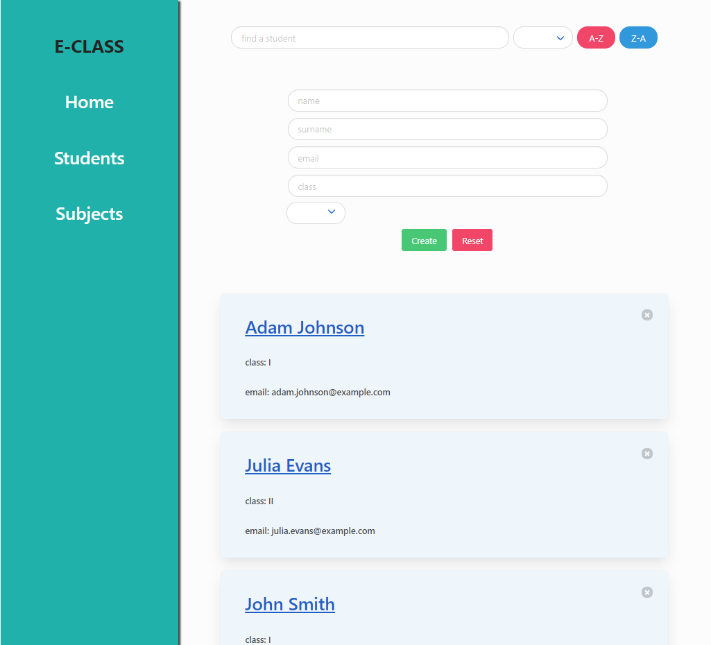
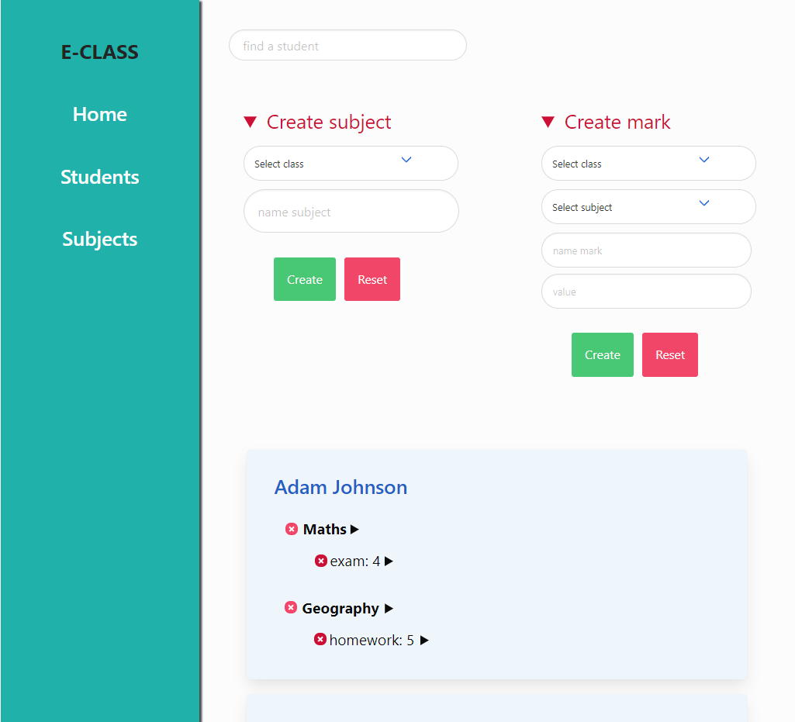
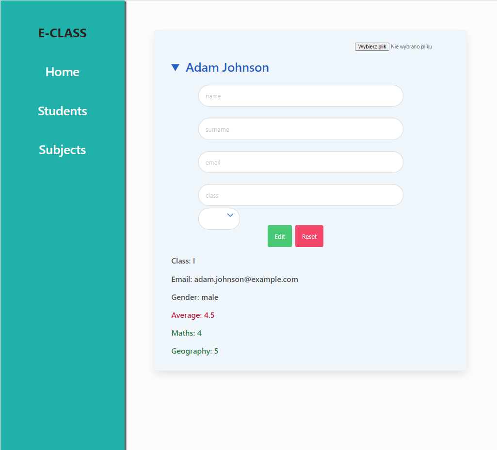
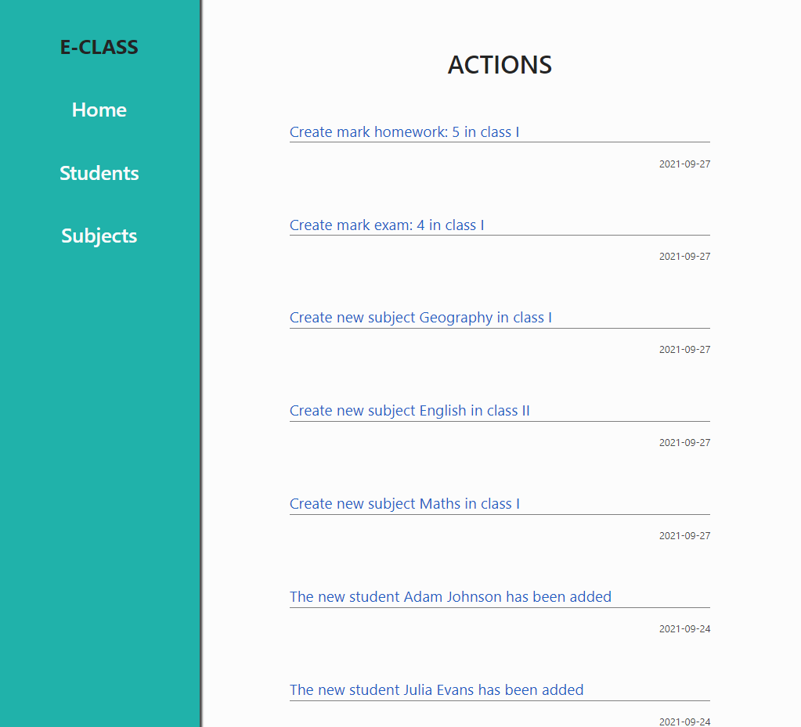

# School register

Project for Frontend Development at University Of Gdańsk by Maciej Tokarz.  
It is a simple application that can help you work with students.

## Used:
- Bulma
- Express
- Formik
- Mongoose
- React
- React redux
- React router
- Redux
- Redux thunk
- Redux api middleware
- Reselect
- Sass

## Create new students and view basic information about them:  
  

## Create school subjects and grades:  
  

## Student details and edit panel:  
  

## History of actions:  
  